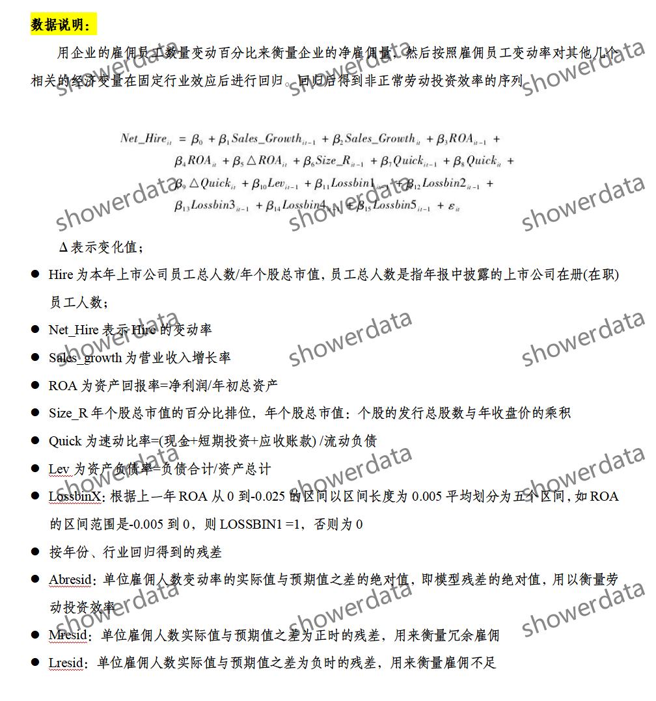
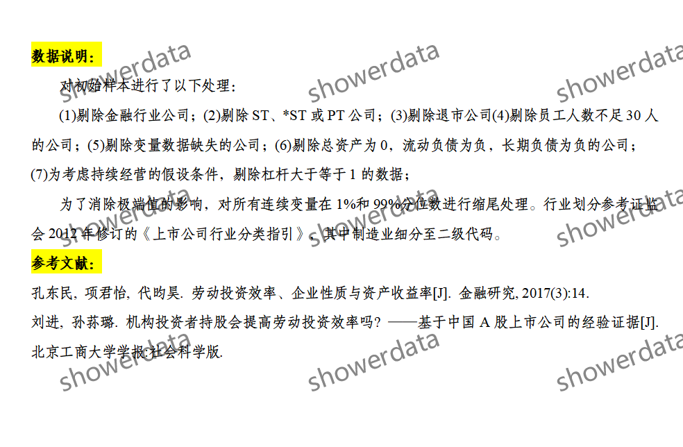
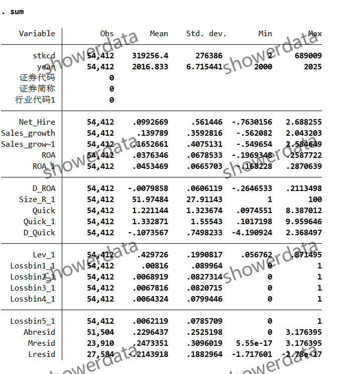
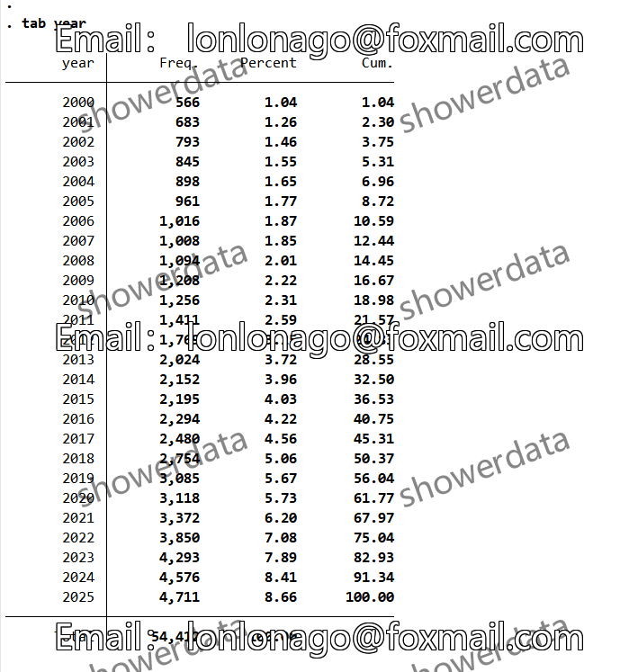
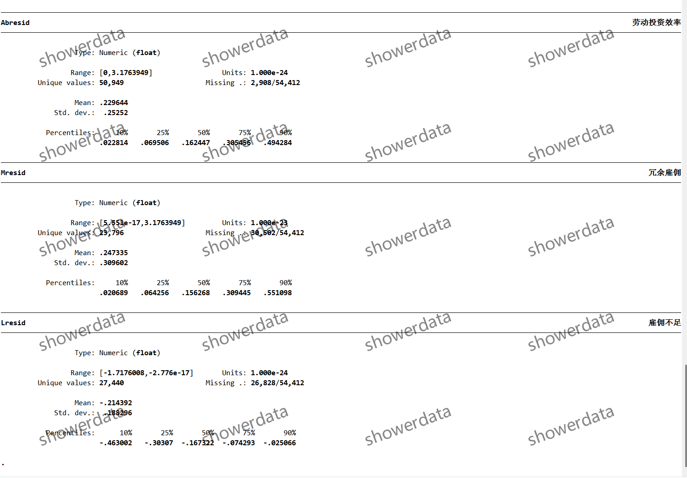
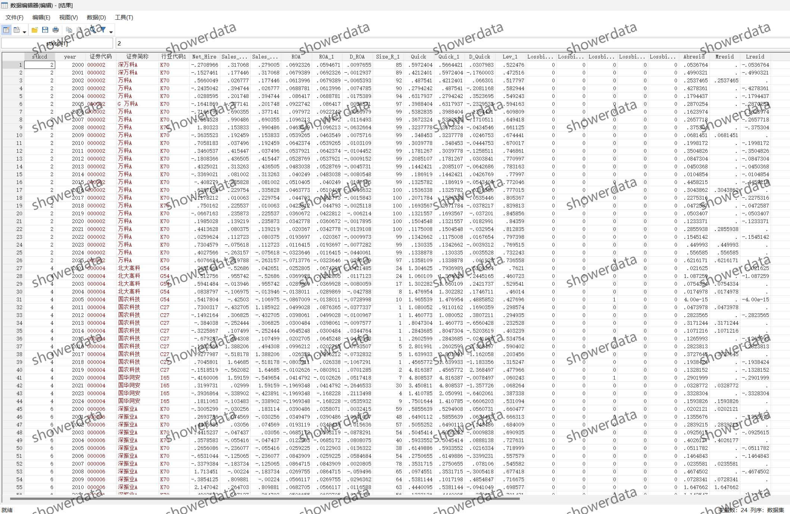
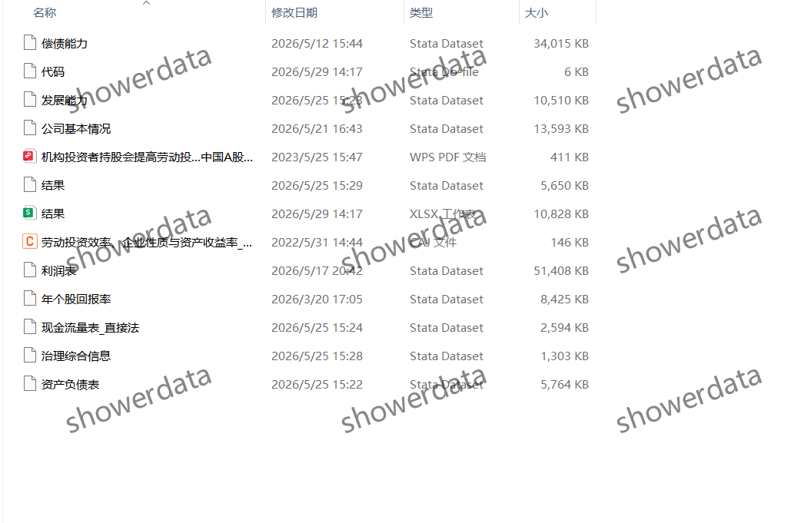

## Body

（2000-2025年）上市公司-企业劳动投资效率指标雇佣冗余不足

After purchase, there is no right to return without reason. There may be missing values, please check before purchasing or ask clearly before buying! The display results are already deduplicated.

I. Data Introduction
(1) Details of the data: See the image below, please check it before purchasing! The displayed explanation is clear, please confirm whether it is what you need before purchasing! No returns or exchanges will be accepted for any reason after shipment! Please confirm that you will use it before purchasing, and do not provide答疑, thank you! There may be missing values due to objective reasons, if you are not willing, please do not purchase, thank you!
(2) Name of the data: List of Employment Redundancy in Listed Companies
(3) Sample range: A company on the drum
(4) Time range: 2000-2025
(5) Data format: Excel, DTA
(6) Content of the data: Results, references, codes, raw data

II. Data Result Indicators as shown in the figure

III. Method of indicator construction as shown in the figure

IV. References as shown in the figure

## Images

Here is a pay link on Stripe ( https://buy.stripe.com/3cs8yP7sY87d0vu9AB ). Please contact me lonlonago@foxmail.com after funding $89, and I will send you a complete data files , thank you!

